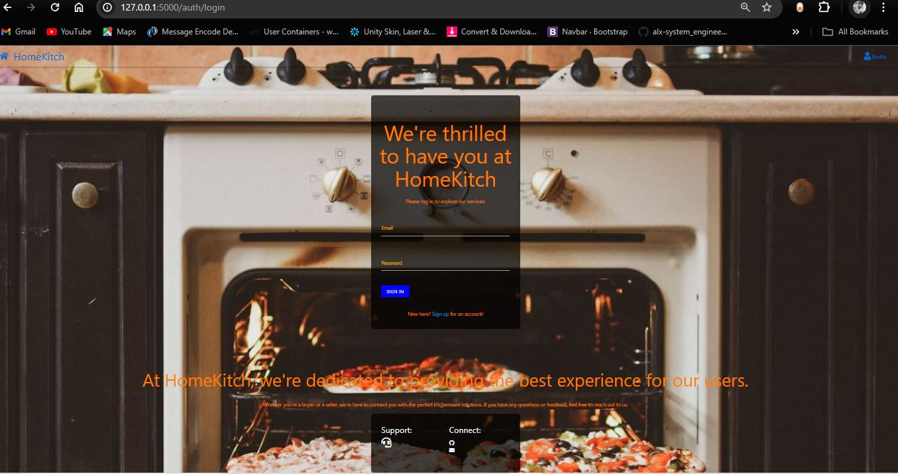
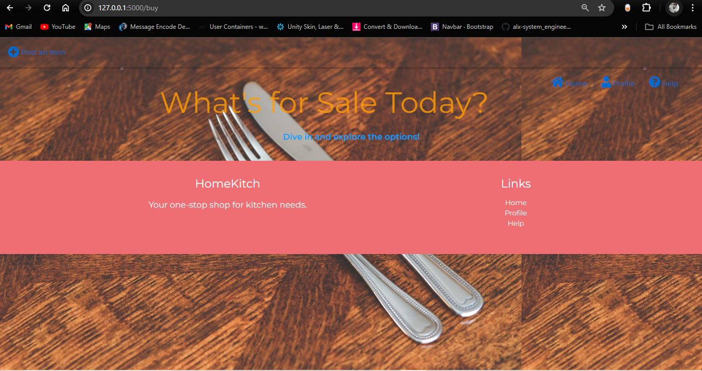

# HomeKitch

Welcome to HomeKitch, a simple Flask web app that connects buyers and sellers of kitchenware.


## Introduction

HomeKitch is designed to create a seamless marketplace for kitchen enthusiasts. Sellers can list kitchenware items they want to sell, and buyers can browse through the listings to find what they need. The platform includes user authentication to ensure a secure and personalized experience.

**Deployed Site:** [HomeKitch Live](https://homekitch.onrender.com)

**Final Project Blog Article:** [Read the Full Story](http://your-blog-article-url.com)

**Author's LinkedIn:** [Mwebaze Innocent](https://www.linkedin.com/in/mwebaze-innocent-a96467166/)

## Features
- **User Authentication:** Sign up and log in securely.
- **Item Listings:** Sellers can post kitchenware items for sale.
- **Browsing:** Buyers can view and search for available items.

## Installation

To set up the project locally, follow these steps:

1. Clone the repository:
   ```bash
   git clone https://github.com/Innocentem/Portfolio1.git
   cd Portfolio1


2. Install the required dependencies:

    pip install -r requirements.txt

3. Set up the environment variables:

    Create a .env file in the project root.
    Add the necessary environment variables (contact the owner for the specific values required).

.gitignore and Security

    This project includes a .gitignore file to ensure sensitive files, such as bots.env, are not pushed to the repository for security reasons. Contact the owner for the .env file (GitHub: Innocentem).

Run the application:

    python app.py

After starting the server, open your browser and navigate to: http://127.0.0.1:5000/

Usage:

    1. Sign Up or Log In: Create an account or log in to access the full features of HomeKitch.
    2. Post an Item: If you are a seller, navigate to the post item page to list your kitchenware.
    3. Browse Items: If you are a buyer, browse through the listings and find the kitchenware you need.

Contributions:

    Contributions are welcome! Please fork the repository and create a pull request with your changes. For major changes, please open an issue first to discuss what you would like to change.

Challenges and Learnings:

    Building HomeKitch was a rewarding yet challenging experience. One of the main challenges I faced was implementing secure user authentication. Ensuring that user data is protected and that the authentication process is both robust and user-friendly required significant research and testing.



    Another challenge was designing a clean and intuitive user interface. I wanted the platform to be easy to navigate for both buyers and sellers, which involved multiple iterations and user feedback to get right.

Vision for the Future:

While HomeKitch is currently functional, there are several features and improvements I envision for future iterations:
    Enhanced Search and Filtering: Implement more advanced search and filtering options to help users find exactly what they are looking for.

    Reviews and Ratings: Add a system for buyers to leave reviews and ratings for sellers, building trust within the community.

    Payment Integration: Integrate secure payment options directly within the platform to streamline transactions.

    Mobile Optimization: Improve the mobile experience to make it easier for users to browse and list items on the go.

